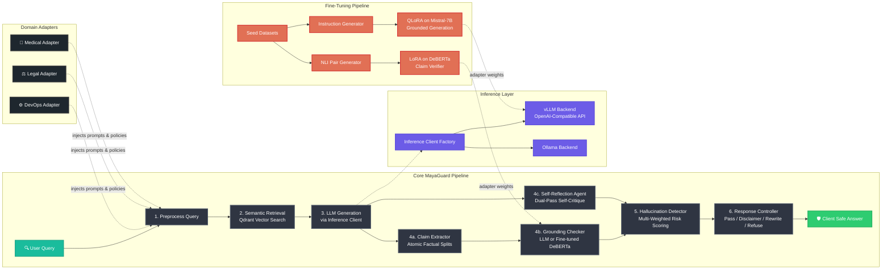
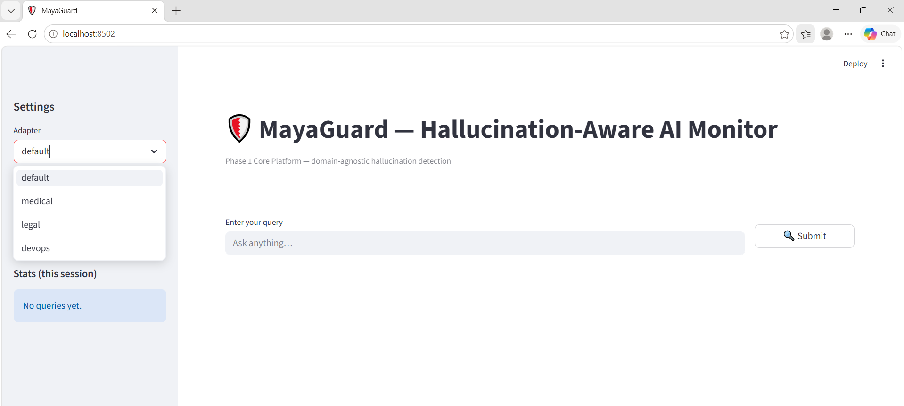

# 🛡️ MayaGuard

[](https://opensource.org/licenses/MIT)
[](https://www.python.org/)
[](https://qdrant.tech/)
[](https://github.com/astral-sh/ruff)
[](https://github.com/python/mypy)

**MayaGuard** (*Maya* - माया, meaning illusion or hallucination) is a modular, high-reliability safety layer that sits between an LLM and the user. It intercepts LLM generated responses, performs multi-stage semantic fact-checking and self-reflection against authoritative reference knowledge stored in **Qdrant**, and applies adaptive control policies (pass-through, disclaimer, rewrite, or refusal) based on calculated hallucination risk scores.

---

## 🏛️ System Architecture & Workflow

MayaGuard runs an adapter-aware, domain-agnostic pipeline that ensures LLM responses remain strictly grounded in verified facts before reaching the client:



---

## 🖥️ Interactive Dashboard Preview

Below is a walkthrough of the MayaGuard visual monitoring dashboard, demonstrating the active medical adapter verification and safety routing flows:

### 1. Unified Monitoring Dashboard (Landing Page)
A clean, premium, and responsive monitoring interface when no query has been run:


### 2. Live Clinical Query Submission
Submitting a patient question using the **Medical Adapter** profile (which enforces strict clinical constraints and a `0.45` risk safety threshold):


### 3. Safety Check: Dangerous Hallucination Intercepted & Refused
When an ungrounded or hazardous claim is generated (e.g. claiming *Metformin is a cure for cancer*), MayaGuard automatically triggers a **High-Risk Refusal**, presenting the safe answer, a detailed claim-by-claim analysis, and a live trace of the cited clinical abstracts:

#### Safe Refusal Page:


#### Claim-level Analysis & Grounded References Trace:


---

## ✨ Features

- **Decoupled Domain Architecture:** Swap domain contexts (Medical, Legal, DevOps) dynamically via a unified `DomainAdapter` registry. Decouples prompts, safety thresholds, and citation layouts from the core platform logic.
- **Strict Grounding Verification:** Automatically extracts atomic factual claims from raw LLM responses and cross-examines them individually against Qdrant-indexed documentation.
- **Double-Pass Self-Reflection:** Orchestrates a secondary critique pass where the LLM evaluates its own output for accuracy, returning structural critiques and confidence scores.
- **Adaptive Response Controller:** Enforces rule-based policies depending on risk level:
  - **LOW:** Pass through unchanged and append sources.
  - **MEDIUM:** Append standard verification warnings and disclaimers.
  - **HIGH:** Trigger a real-time, cautious **citation-grounded rewrite** of the response.
  - **CRITICAL:** Fully block the response and provide a list of unverifiable claims.
- **Hallucination Floor Penalty:** Automatically guarantees a minimum risk score when critical claims go unsupported, preventing severe hallucinations from diluting overall score averages.
- **Unified Seeding CLI:** Ingests and indexes high-density JSON seed datasets (e.g. PubMed abstracts, legal terms, Kubernetes specs) into active vector collections in a single command.
- **Rich Dashboard:** View real-time risk gauges, latency statistics, claim-by-claim verdicts, and trace sources via a Streamlit visual dashboard.
- **vLLM Production Serving:** Pluggable inference backend abstraction layer that transparently routes generation to either Ollama (development) or vLLM (production GPU serving with continuous batching and PagedAttention).
- **LoRA Fine-Tuned Claim Verifier:** Fine-tuned DeBERTa-v3-base classifier for fast (~50ms/claim) NLI-style claim verification, replacing the slower LLM-based grounding checker.
- **QLoRA Fine-Tuned LLM:** Mistral-7B fine-tuned with QLoRA (4-bit NF4 quantization) for hallucination-aware, citation-grounded response generation.

---

## 🚀 Getting Started & How to Run

MayaGuard supports two execution paths:
1. **Fully Local & Offline Mode (Fastest - Zero Setup)**: Runs completely on your native Windows machine without Docker or an active Ollama instance. Uses a lightweight local persistent folder database (`mayaguard_qdrant_local`) and high-fidelity keyword-overlap verifiers. **Perfect for immediate testing, dry-runs, and capturing portfolio screenshots!**
2. **Docker & LLM Integration Mode**: Connects to active Docker Qdrant containers and local Ollama GPU inference models for fully dynamic neural verification.

---

### 📋 Prerequisites & Setup

Ensure you have **Python 3.10+** installed on your system.

#### 1. Clone & Install Dependencies
Establish a Python virtual environment and install the package along with its dev and frontend dependencies in editable mode:
```powershell
# Clone the repository
git clone https://github.com/Yogesh-001/mayaguard.git
cd mayaguard

# Create and activate virtual environment
python -m venv .venv
.venv\Scripts\activate  # On macOS/Linux use: source .venv/bin/activate

# Install required dependencies
pip install -e ".[dev,frontend]"
```

#### 2. Create Environment Configuration
Establish your local configuration file:
```powershell
copy .env.example .env  # On macOS/Linux use: cp .env.example .env
```

---

### ⚡ Method A: Running in Fully Local / Offline Mode (Fast & Zero-Docker)
No Docker Desktop or active Ollama servers needed. The system automatically falls back to native file-system storage and intelligent keyword alignments.

#### Step 1: Seed the local knowledge base
Ingest all real clinical abstracts, legal statutes, and DevOps configurations directly to disk storage:
```powershell
python main.py seed
```
*(You will see active logs confirming Qdrant local database persistence folders have been successfully created and populated).*

#### Step 2: Start the FastAPI API Server
Start the backend serving engine on local port `8080`:
```powershell
python main.py serve
```

#### Step 3: Launch the Streamlit Monitoring Dashboard
In a **new terminal window** (make sure to activate the virtual environment `.venv\Scripts\activate`), start the interactive UI:
```powershell
python main.py dashboard
```
Open your browser and navigate to the Streamlit local server (typically running on `http://localhost:8501`). You can immediately submit queries and select any active domain adapter (medical, legal, devops) to see dynamic intercept checks and safety refusals!

---

### 🐳 Method B: Running in Docker & LLM Integration Mode
Connects to live containerized infrastructure for deep semantic embeddings and dynamic text evaluations.

#### Step 1: Spin up container infrastructure
Launch the Qdrant and Ollama servers in the background using Docker Compose:
```powershell
docker compose up qdrant ollama -d
```

#### Step 2: Pull the inference LLM
Download the instruction-tuned model through Ollama:
```powershell
python main.py pull-model
```

#### Step 3: Seed, Serve, and Launch the Dashboard
Run the same CLI commands to populate Qdrant, spin up the API serving layers, and run the Streamlit frontend dashboard:
```powershell
# 1. Seed the vector database
python main.py seed

# 2. Launch serving app
python main.py serve

# 3. Launch dashboard (in a separate terminal)
python main.py dashboard
```

---

## 🎛️ Domain Adapters Configuration

MayaGuard separates domain parameters into independent adapters. The framework is pre-configured with three high-fidelity domains:

### 🏥 Medical Domain
- **Threshold:** Strict `risk_threshold_override = 0.45` to protect patient well-being.
- **Safety Policy:** Mandatory clinical disclaimer appended to all queries.
- **Prompt:** Enforces strict scientific caution and references PubMed and WHO guidelines.

### ⚖️ Legal Domain
- **Threshold:** Moderate-strict `risk_threshold_override = 0.50` to maintain compliance.
- **Safety Policy:** Mandatory statutory disclaimer clarifying that this is not formal legal counsel.

### ⚙️ DevOps Domain
- **Threshold:** Standard `risk_threshold_override = 0.55` for server configuration checks.
- **Safety Policy:** Excludes standard disclaimers to keep systems output clean and highly readable.

## 🔌 RAG Integration & Custom Adapters

MayaGuard can be easily integrated into **any** existing Python, JavaScript/TypeScript, or Go RAG pipeline. If your application covers topics other than the pre-built domains (Medical, Legal, DevOps) - such as Aerospace or Orbital Systems (AOS) - you can use the generic `"default"` profile out of the box, or easily implement and register your own custom domain adapter!

For a full step-by-step developer guide on RAG integration strategies and adapter design patterns, see the **[MayaGuard RAG Integration & Adapter Guide](INTEGRATION.md)**.

---

## ⚡ vLLM Production Serving

MayaGuard uses a pluggable **inference client abstraction** (`core/inference/`) that transparently routes all LLM calls to either Ollama or vLLM based on configuration:

```
┌───────────────────────────┐
│   Inference Client Factory │
│   get_inference_client()   │
└──────────┬────────────────┘
           │
     ┌─────┴──────┐
     ▼            ▼
┌─────────┐  ┌─────────┐
│ Ollama  │  │  vLLM   │
│ Client  │  │ Client  │
└─────────┘  └─────────┘
```

To enable vLLM serving, set `VLLM_ENABLED=true` in your `.env` and start a vLLM server:
```bash
python -m vllm.entrypoints.openai.api_server \
    --model mistralai/Mistral-7B-Instruct-v0.2 \
    --max-model-len 4096
```

vLLM also supports serving QLoRA adapters natively via `--enable-lora`.

---

## 🧬 Fine-Tuning Guide

MayaGuard includes two fine-tuning pipelines using parameter-efficient methods (PEFT) that run on **Google Colab free tier (T4 GPU)**:

### 1. Claim Verification Classifier (LoRA on DeBERTa)
Fine-tunes a specialized NLI classifier to replace the LLM-based grounding checker with a model that is **~40x faster** at claim verification.

| Property | Value |
|----------|-------|
| Base Model | `microsoft/deberta-v3-base` |
| Method | LoRA (rank 16, alpha 32) |
| Training Time | ~15-30 min on T4 |
| Adapter Size | ~2-5 MB |

### 2. Hallucination-Aware LLM (QLoRA on Mistral-7B)
Fine-tunes Mistral-7B with 4-bit quantization to generate grounded, citation-aware responses.

| Property | Value |
|----------|-------|
| Base Model | `mistralai/Mistral-7B-Instruct-v0.2` |
| Method | QLoRA (4-bit NF4, rank 64) |
| Training Time | ~45-90 min on T4 |
| Adapter Size | ~50-100 MB |

**Quick Start:**
```bash
# Generate training datasets from seed data
python -m finetuning.data.generate_nli_dataset
python -m finetuning.data.generate_instruct_dataset

# Open notebooks in Google Colab and train
# See finetuning/README.md for detailed instructions
```

## 🔌 RAG Integration & Custom Adapters

MayaGuard can be easily integrated into **any** existing Python, JavaScript/TypeScript, or Go RAG pipeline. If your application covers topics other than the pre-built domains (Medical, Legal, DevOps) - such as Aerospace or Orbital Systems (AOS) - you can use the generic `"default"` profile out of the box, or easily implement and register your own custom domain adapter!

For a full step-by-step developer guide on RAG integration strategies and adapter design patterns, see the **[MayaGuard RAG Integration & Adapter Guide](INTEGRATION.md)**.

---

## 🧪 Testing

MayaGuard features an isolated, offline-safe test suite that bypasses real network connections to Qdrant or Hugging Face. Running tests requires no active Docker containers:

```bash
python -m pytest -v
```

All **15 unit and integration tests** execute in under 0.6 seconds, validating adapter structures, risk classifiers, and end-to-end pipeline controllers.

---

## 📄 License
MayaGuard is open-source software licensed under the **[MIT License](LICENSE)**.
